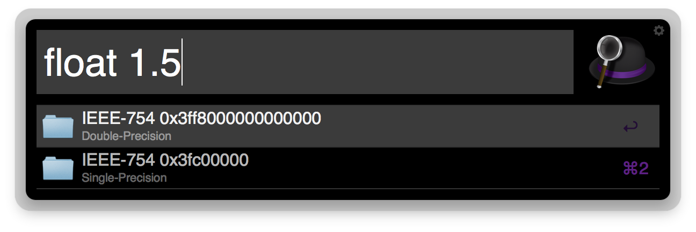
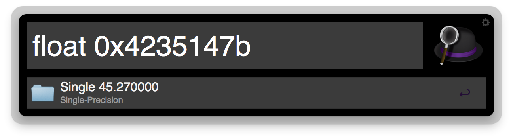
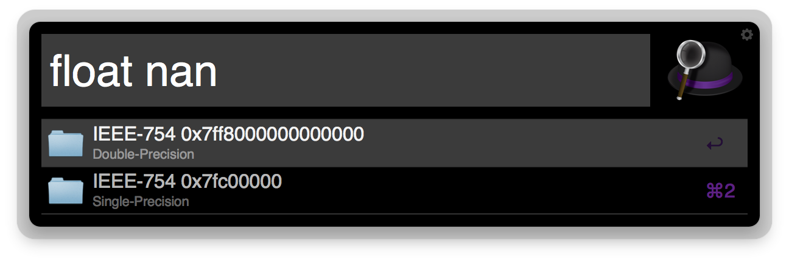

# FPtoIEEE754Hex

Alfred Extension to convert from FP to IEEE 754 hex representation and back.

## Usage
Use the keyword 'float' followed by the value you want to convert.

## Requirements
Requires Alfred 2 and the Powerpack. Both available here:
http://www.alfredapp.com

## Installation
Download the extension file by [clicking here](http://bit.ly/14cjhS7) and open it with Alfred.

## Sources
The C source file and the Makefile are in the src directory.

